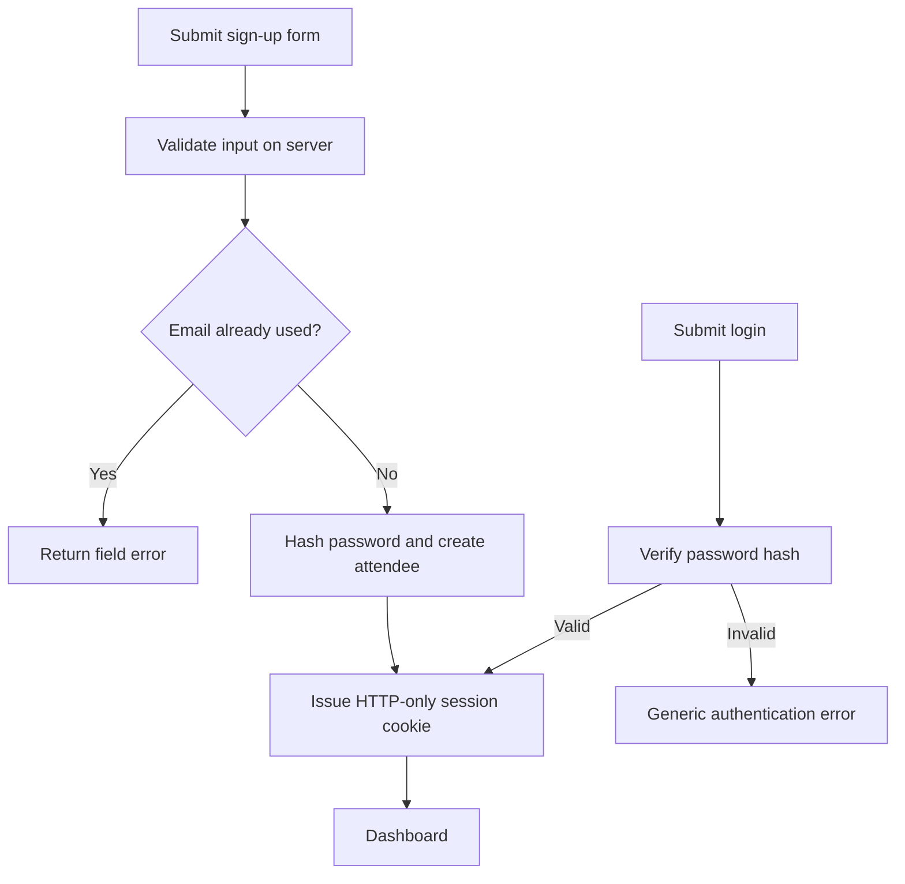
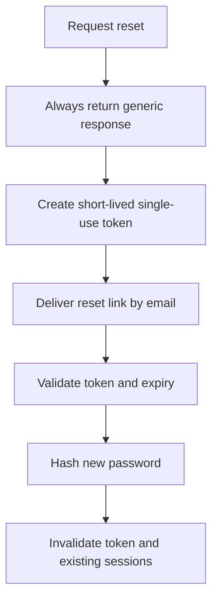
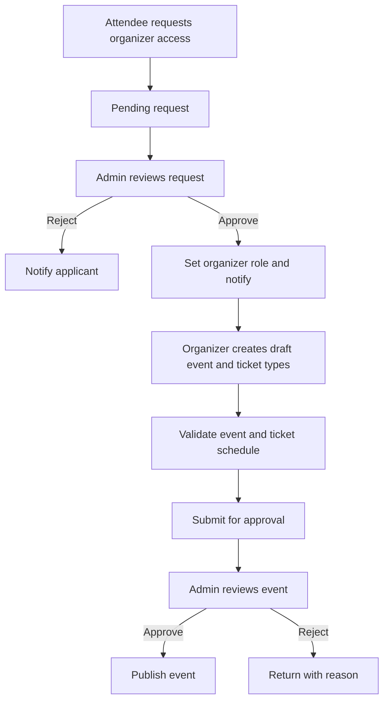
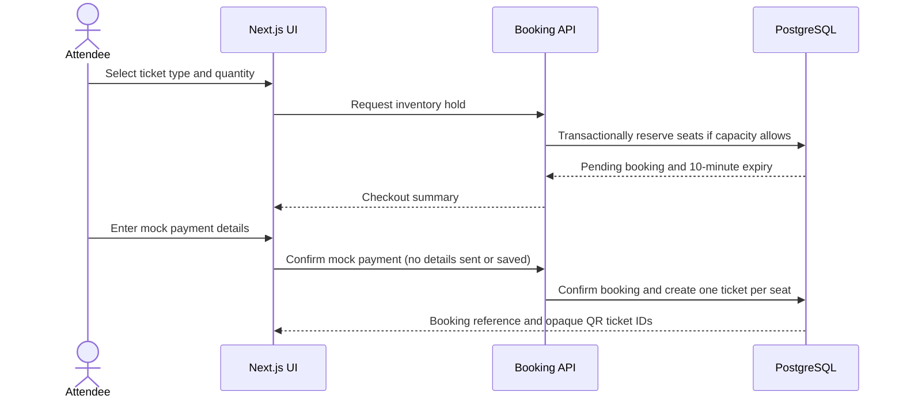
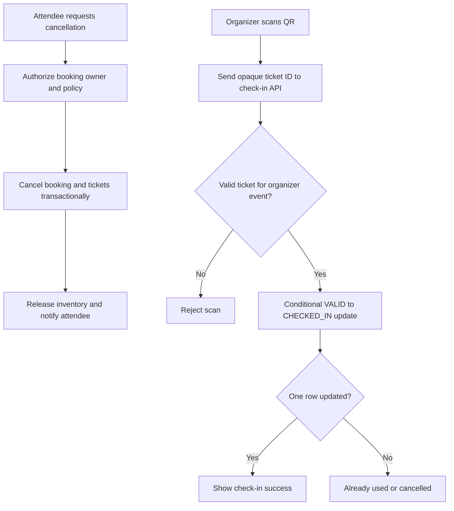

# Product flows

## Sign up and login

```mermaid
flowchart TD
  A[Submit sign-up form] --> B[Validate input on server]
  B --> C{Email already used?}
  C -->|Yes| D[Return field error]
  C -->|No| E[Hash password and create attendee]
  E --> F[Issue HTTP-only session cookie]
  F --> G[Dashboard]
  H[Submit login] --> I[Verify password hash]
  I -->|Valid| F
  I -->|Invalid| J[Generic authentication error]
```

## Forgot and reset password

```mermaid
flowchart TD
  A[Request reset] --> B[Always return generic response]
  B --> C[Create short-lived single-use token]
  C --> D[Deliver reset link by email]
  D --> E[Validate token and expiry]
  E --> F[Hash new password]
  F --> G[Invalidate token and existing sessions]
```

## Organizer approval and event publishing

```mermaid
flowchart TD
  A[Attendee requests organizer access] --> B[Pending request]
  B --> C[Admin reviews request]
  C -->|Reject| D[Notify applicant]
  C -->|Approve| E[Set organizer role and notify]
  E --> F[Organizer creates draft event and ticket types]
  F --> G[Validate event and ticket schedule]
  G --> H[Submit for approval]
  H --> I[Admin reviews event]
  I -->|Approve| J[Publish event]
  I -->|Reject| K[Return with reason]
```

## Ticket booking, cancellation, and check-in

```mermaid
sequenceDiagram
  actor Attendee
  participant Web as Next.js UI
  participant API as Booking API
  participant DB as PostgreSQL
  Attendee->>Web: Select ticket type and quantity
  Web->>API: Request inventory hold
  API->>DB: Transactionally reserve seats if capacity allows
  DB-->>API: Pending booking and 10-minute expiry
  API-->>Web: Checkout summary
  Attendee->>Web: Enter mock payment details
  Web->>API: Confirm mock payment (no details sent or saved)
  API->>DB: Confirm booking and create one ticket per seat
  DB-->>Web: Booking reference and opaque QR ticket IDs
```

```mermaid
flowchart TD
  A[Attendee requests cancellation] --> B[Authorize booking owner and policy]
  B --> C[Cancel booking and tickets transactionally]
  C --> D[Release inventory and notify attendee]
  E[Organizer scans QR] --> F[Send opaque ticket ID to check-in API]
  F --> G{Valid ticket for organizer event?}
  G -->|No| H[Reject scan]
  G -->|Yes| I[Conditional VALID to CHECKED_IN update]
  I --> J{One row updated?}
  J -->|Yes| K[Show check-in success]
  J -->|No| L[Already used or cancelled]
```
